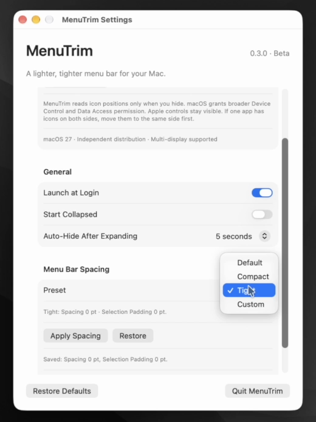
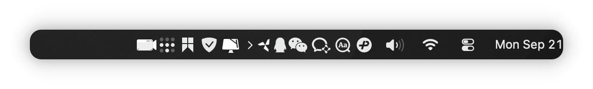
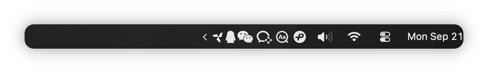

# MenuTrim

  

<strong>Take back your Mac menu bar space. 让 Mac 菜单栏重新清爽。</strong>

  <a href="https://github.com/hyvasslli/MenuTrim/releases/latest"><strong>Download Latest Release / 下载最新版</strong></a>

## Demo / 演示

  

<a href="Media/MenuTrim-Demo.mp4">Watch the 30-second demo / 观看 30 秒演示</a>

## English

MenuTrim is a lightweight, native macOS menu bar space manager. Put less important third-party menu bar icons to the left of its divider, then hide or reveal them with one click without quitting their apps.

### Before / After

| Expanded | Collapsed |
| --- | --- |
|  |  |

### Features

- One-click collapse and expand
- Auto collapse after 3, 5, or 10 seconds, or keep it off
- Keyboard shortcut
- Launch at login
- Retain collapsed state with multiple displays
- Compact, tight, or custom spacing for compatible third-party menu bar items
- Native macOS app with no account, advertising, analytics, tracking, or subscription

Apple system controls remain visible. MenuTrim does not change their spacing.

### Download and installation

1. Download the latest DMG from [GitHub Releases](https://github.com/hyvasslli/MenuTrim/releases/latest).
2. Open the DMG and drag MenuTrim to Applications.
3. Launch MenuTrim and grant the requested **Device Control and Data Access** permission.
4. Hold Command and drag the third-party icons you want to manage to the left of the MenuTrim divider.
5. Click the chevron to hide or reveal them.

The release contains a Developer ID signed app. Its DMG has been accepted by Apple notarization and includes a stapled notarization ticket.

### Requirements

- macOS 27 or later
- Device Control and Data Access permission

MenuTrim uses this permission only when it needs to identify the positions and owning apps of visible third-party menu bar items. Processing stays on your Mac.

### Privacy

MenuTrim does not collect analytics, personal data, or usage data. Preferences are stored locally. See [PRIVACY.md](PRIVACY.md).

### Support

Bug reports and feature suggestions are welcome through [GitHub Issues](https://github.com/hyvasslli/MenuTrim/issues).

### License

MenuTrim is free to download and use. Created by Yang Han (Hany). Copyright © 2026 Yang Han (Hany). All rights reserved. The source code is not publicly distributed. See [LICENSE.txt](LICENSE.txt).

More apps by Hany: [github.com/hyvasslli](https://github.com/hyvasslli)

---

## 中文

MenuTrim 是一款轻量、原生的 macOS 菜单栏空间管理工具。将不常用的第三方菜单栏图标放到分界线左侧，即可一键隐藏或显示，无需退出对应应用。

### 使用前后

| 展开 | 收起 |
| --- | --- |
|  |  |

### 主要功能

- 一键收起或展开指定菜单栏图标
- 展开后可在 3、5 或 10 秒后自动收起，也可关闭自动收起
- 支持键盘快捷键
- 支持登录时启动
- 多显示器使用时保持收起状态
- 为兼容的第三方菜单栏项目设置紧凑、较紧或自定义间距
- 原生 macOS 应用，无账户、广告、统计、跟踪和订阅

Apple 系统控制图标始终保留，MenuTrim 不修改系统图标间距。

### 下载与安装

1. 从 [GitHub Releases](https://github.com/hyvasslli/MenuTrim/releases/latest) 下载最新版 DMG。
2. 打开 DMG，将 MenuTrim 拖入“应用程序”文件夹。
3. 启动 MenuTrim，并授予“设备控制与数据访问”权限。
4. 按住 Command 键，将需要管理的第三方图标拖到 MenuTrim 分界线左侧。
5. 点击箭头收起或展开这些图标。

正式版本中的应用已使用 Apple Developer ID 签名，DMG 已通过 Apple 公证并写入公证票据。

### 系统要求

- macOS 27 或更高版本
- “设备控制与数据访问”权限

MenuTrim 仅在需要识别当前可见第三方菜单栏项目的位置和所属应用时使用该权限，所有处理均在本机完成。

### 隐私

MenuTrim 不收集统计数据、个人数据或使用数据，设置仅保存在本机。详见 [PRIVACY.md](PRIVACY.md)。

### 支持

欢迎通过 [GitHub Issues](https://github.com/hyvasslli/MenuTrim/issues) 提交问题和功能建议。

### 许可

MenuTrim 可免费下载和使用。作者：Yang Han (Hany)。Copyright © 2026 Yang Han (Hany)。保留所有权利。源代码不公开分发。详见 [LICENSE.txt](LICENSE.txt)。

Hany 的更多应用：[github.com/hyvasslli](https://github.com/hyvasslli)
